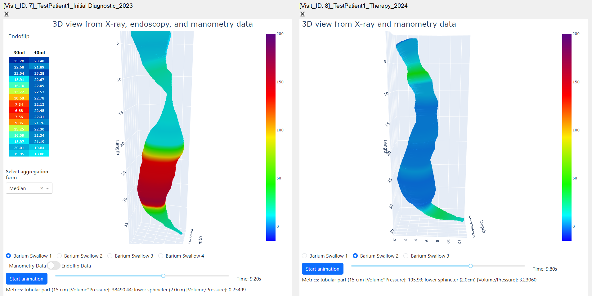

# Esophagus Visualization and Data Management Software

This software is designed to support the diagnosis and treatment of achalasia by storing patient data and generating 3D visualizations of the esophagus.  
It is developed in the context of higher education at the chair for software methodologies and distributed systems at the University of Augsburg, and in close cooperation with the gastroenterology at the University Hospital Augsburg.

## Key Features

- **Patient and Visit Management**: Save and manage data about patients, their visits, and their therapies, including complications and outcomes.
- **Imaging Data Storage**: Store imaging data such as barium swallow images, endoscopy images, EndoFLIP images, endosonography images, and endosonography videos, linked to patient records and visits.
- **Diagnostic File Handling**: Handle and store manometry files (.csv) and EndoFLIP files (.xlsx) from diagnostic instruments.
- **3D Esophagus Reconstruction**: Generate 3D reconstructions of the esophagus from barium swallow X-rays and optionally endoscopy images. These reconstructions can be saved and linked to patient records.
- **3D Visualization**:
  - **Pressure Mapping**: Create animated color mappings of manometry measurements on the 3D reconstruction.
  - **Distensibility Mapping**: Generate color mappings and tabular representations of EndoFLIP measurements on the 3D reconstruction.
  - **Supports multiple barium swallow images**: Switch between visualizations of different barium swallow images with selection via radio button.
  - **Metrics**: Calculate metrics for the tubular region (volume x pressure) and the sphincter region (volume / pressure).
  - **Side-by-Side Comparison**: Display multiple 3d visualizations side-by-side for comparisons (e.g., pre/post-therapy, different patients).
- **Data Export**:
  - **3D Reconstructions**: Export metrics as .csv, the 3D reconstruction as .html for external display, and the reconstruction as .stl file for 3D printing.
  - **Database Exports**: Download data about patients, their visits, and their therapies for statistical analysis.

## Supported File Types

The software can handle and store the following file types:
- Manometry measurements (.csv from 'Laborie stationary measurement & analysis software' by Medical Measurement Systems B.V.)
- Frontal barium swallow X-ray images
- Endoscopy images of the esophagus (EGD)
- EndoFLIP files (.xlsx)
- Additionally, EndoFLIP images and endosonography images and videos can be uploaded and saved into the database (these files are not yet used for 3D visualization).



## Getting Started

### Setup Environment

1. **Create Environment**:
    ```sh
    conda create -n "esophagus-visualization" python=3.9.7 ipython
    conda activate esophagus-visualization
    ```

2. **Install Requirements**

```sh
pip install -r requirements.txt
```
- Note: If you encounter issues with the debug mode in PyCharm:

  1. Go to the **File** menu.
  2. Select **Settings** (or **Preferences** on macOS).
  3. In the left sidebar, navigate to **Build, Execution, Deployment** -> **Debugger**.
  4. Under the **Python Debugger** section, check the option named **PyQt compatible**.
  5. Ensure the **PyQt version** is set to **PyQt6**.


### Setup Docker
1. **Install Docker Desktop**: 
    - If you don't already have Docker Desktop installed, download and install it from the [Docker website](https://www.docker.com/products/docker-desktop). 


2. **Run Docker Compose**:
    - Ensure you are in the directory containing the `docker-compose.yml` and `init.sql` files.
    - Open a terminal in this directory and execute the following command to start the containers:
      ```sh
      docker-compose up -d
      ```
    - This command will build and start the containers.


3. **Access pgAdmin**:
    - Once the containers are up and running, you can access pgAdmin to manage the PostgreSQL database of this app.
    - Open your web browser and go to `http://localhost:8080`.
    - Use the following credentials to log in:
      - **Username**: `admin@admin.com`
      - **Password**: `123+qwe`
    - Register a new Server:
      - Right-click on "Servers" and select "Register" -> "Server":
        - Tab "General":
          - **Name**: `3drekonstruktionspeiseroehre`
        - Tab "Connection":
          - **Host/name address**: `db`
          - **Port**: `5432`
          - **Maintenance db**: `postgres`
      - Click "Save". You should now see `3drekonstruktionspeiseroehre` listed under "Servers".
      - The database `3drekonstruktion` contains the data schema for this application (initially empty).


### Start the Application

```sh
python ./3drekonstruktionspeiseroehre/main.py
```
- Note: Make sure the docker containers are up and running.

## Creating an Executable
      
1. **Update Paths in `main.spec` File**:
    - Open the `main.spec` file and adjust any absolute paths to match the paths on your system.


2. **Run PyInstaller**:
    - Use PyInstaller to create an executable. Open a terminal and run the following command:
      ```sh
      pyinstaller --noconfirm --clean main.spec
      ```
    - Note: Adjust the path to `main.spec` if necessary.

    - After the PyInstaller process completes, the `main`-folder inside the newly created `dist` folder contains 
   the executable `EsophagusVisualization.exe`, along with Python and all necessary dependencies.


3. **Copy the UI Files to the correct location**:
    - Locate the `ui-files` folder within `dist/main/_internal`.
    - Copy and paste the entire `ui-files` folder directly under the `main` folder (i.e., `dist/main/ui-files`). 


4. **Create an Installer**:

   1. Install [InnoSetup](https://jrsoftware.org/isdl.php).
   2. Open and compile the `inno_setup_script.iss` file with InnoSetup.
       - Note: To edit, always open `inno_setup_script.iss` with InnoSetup to prevent file encoding issues.

## Notes

- Developed with Python version 3.9.7.
- For dependency `cv2`, use `opencv-python-headless` instead of `opencv-python` to avoid conflicts with PyQt.
- Minimum version for `matplotlib` is 3.6.0rc2.
- Configuration values can be adjusted in the `config.py` file.