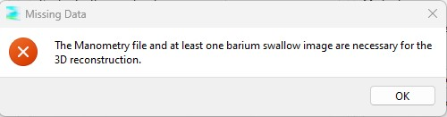
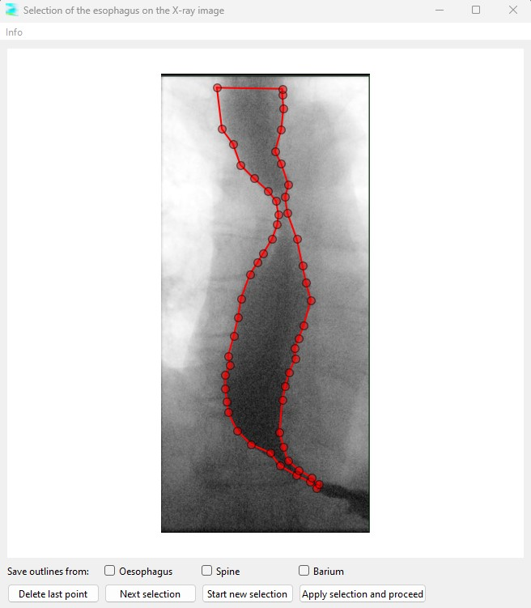
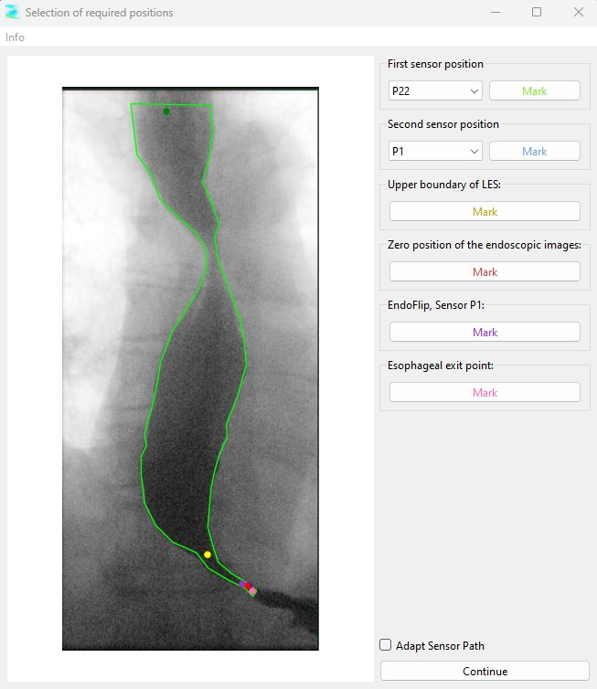
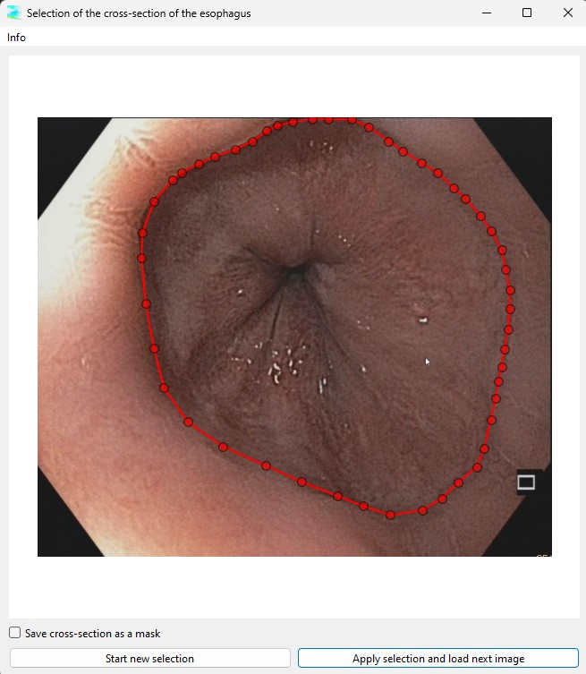
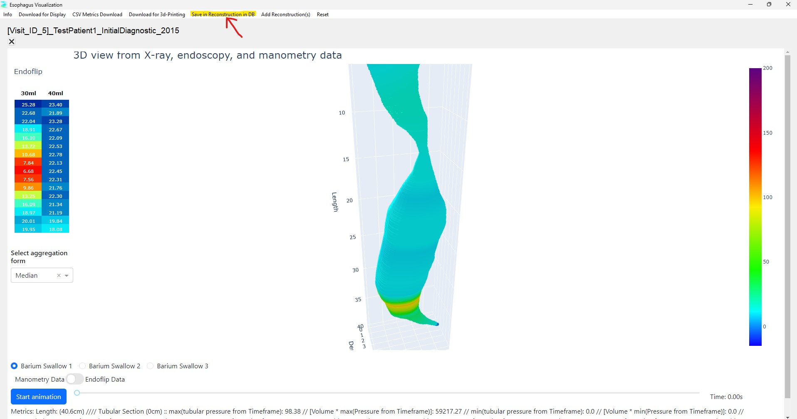
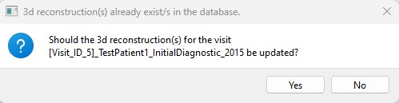
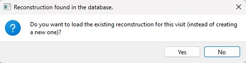

# Creating, saving and loading 3D reconstructions

3D reconstructions of the esophagus (visualizations) can either be generated using manometry data, barium swallow images, and optionally, endoscopy images and EndoFLIP data, or previously saved 3D reconstructions can be loaded from the database.

This guide explains how to create (and save) a new 3D reconstruction and how to load an existing one from the database.

## Creating a New 3D Reconstruction

A new 3D reconstruction can only be created if at least the manometry data and one or more barium swallow images have been uploaded to the database.

To create a 3D reconstruction:

1. Select the patient and the corresponding visit for which you want to create the visualization.
2. Click "Create Visualization for selected Patient and selected Visit" at the bottom of either the Visits Tab or the Diagnostics & Therapy Tab.

If the required data (manometry .csv file and barium swallow image(s)) are missing, a warning will be displayed. Upload all necessary data and then proceed.

Once initiated, a new window will appear displaying the first barium swallow image with the outline of the esophagus automatically selected. However, this selection may not be accurate. You can either:

- Adjust individual points of the outline by dragging them with your mouse.
- Create a completely new selection by clicking "Start new selection."
- The last point set can be deleted by clicking on 'Delete last point'. 
If you create a new outline, ensure that you close it by clicking on the starting point at the end.
If you want to save the outline as a mask to create a dataset for maschine learning, check the respective checkbox. If you want to label the next structure, like the spine, 
click 'Next selection'. The masks will be automatically saved in the C: drive in the folder 'DataAchalasia'. 
When you're done, select "Apply selection and proceed."

In the next window, you will need to mark several key points on the esophagus that are relevant for the visualization algorithm.

1. Start by clicking on the label on the right side of the screen.
2. After selecting a label, set the corresponding point on the image by clicking on the desired location. 
   
Each point you mark will have the same color as the label for easy identification. Continue this process until all required key points have been marked on the image.

When finished, click "Continue".

This process will repeat for each barium swallow image.

Afterward, endoscopy images will be displayed, allowing you to adjust or draw the esophagus's cross-section. Those outline could be saved by checking the checkbox. click 'Next selection'. The masks will be automatically saved in the C: drive in the folder 'DataAchalasia'. 

Once completed, the visualization will be created:

## Saving the 3D Reconstruction

After the 3D reconstruction has been created, you can save it to the database by selecting the corresponding menu option. 

This enables you to easily access the visualization later without repeating the entire process. Simply load the reconstruction from the database whenever needed.

If a 3D reconstruction for the selected visit already exists in the database, the program will prompt you to confirm if you want to update the existing 3D reconstruction and save the new one.

## Loading Existing 3D Reconstructions from the Database

If a 3D reconstruction for a visit has already been saved, you can load it instead of creating a new one:

1. Select the patient and the corresponding visit for which you want to load the visualization.
2. Click "Create Visualization for selected Patient and selected Visit" at the bottom of either the Visits Tab or the Diagnostics & Therapy Tab.

The program will prompt you to either create a new 3D reconstruction or load the existing one.

