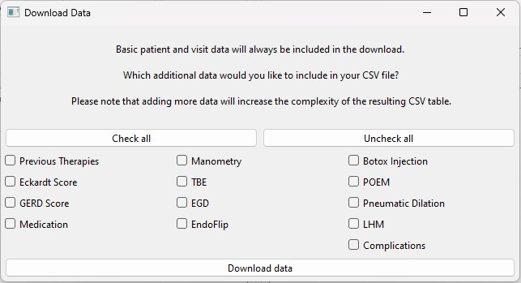

# Download Data

The "Download Data" option of the database interface menu allows you to download descriptive data for medical statistics.

When you click **Download Data**, a new window will open where you can specify the types of data you wish to download.

### Steps to Download Data:

1. **Select Data**: In the window, choose the data you want to download. Basic patient and visit information will always be included by default. If you only want to download a list of patients and visits, simply leave the other options unchecked.
   
2. **Download**: Once you've made your selection, click the **Download data** button.

3. **Specify Path**: After clicking the button, you will be prompted to specify a path on your system where the data will be saved.

This feature is useful for generating datasets for further analysis or statistics.