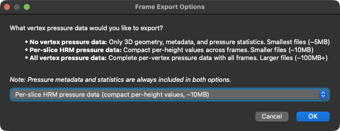

# Download VTKHDF Ground Truth Data

Use the **Download VTKHDF for ML/3d-Printing** action in the visualization window to export every visible reconstruction as a `.vtkhdf` file that contains the geometry, metadata, and optional pressure measurements required for ground truth datasets.

## When to Use
- Create benchmark data for machine-learning pipelines.
- Share reconstructions with research partners together with all clinical metadata.
- Prepare models for 3D printing software that supports the VTKHDF format.

## Export Steps
1. Open the visualization window and make sure the reconstructions you want to export are loaded.
2. Click **Download VTKHDF for ML/3d-Printing** in the menu bar.
3. Choose how much **HRM pressure data** should be embedded:
   - *No vertex pressure data*: only geometry, metadata, and summary statistics (smallest files).
   - *Per-slice HRM pressure data*: compact per-height pressure curves (recommended default).
   - *All vertex pressure data*: complete per-vertex pressure frames (largest files, full fidelity).
4. Decide whether to create an additional **validation attributes (JSON)** file. It contains reconstruction settings that help downstream quality checks.
5. Pick the destination folder. The exporter writes one `.vtkhdf` per reconstruction; if validation data is enabled a matching `.json` is added.
6. Wait for the confirmation message summarising how many mesh and validation files were written.

## Resulting Files
- `*.vtkhdf`: Mesh with geometry, visit/patient metadata, wall thickness, anatomical regions, and the selected pressure export mode.
- `*.json` (optional): Validation attributes with acquisition parameters, thresholds, and exporter version.

> Tip: Filenames are derived from the visit label, ensuring that multiple reconstructions exported together keep their visit context.
