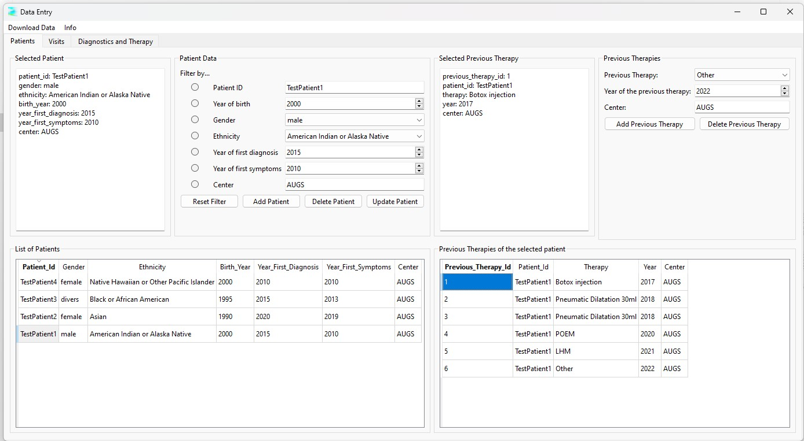

# The Patients Tab

The Patients Tab is your primary interface for managing patient data within the database. 
Here, you can register new patients, update existing records, delete patients when necessary, and track therapies that don’t require a visit record. 
The tab also provides tools to sort and filter patient information to retrieve specific records.  

The functions of the Patients Tab are explained in detail below.

## Registering a New Patient

The first step in using the database is typically to register a new patient. To do this:

1. Fill out all the available information for the patient.
2. Click the "Add Patient" button.

The software will automatically perform validity checks on the data you've entered. 
If you're unsure of any year, simply leave the field as is (set to 1900). 
In the database, this value will be interpreted as "unknown".

## Updating Patient Information

If you need to correct any patient information, you can easily update the data. Simply:

1. Select the patient from the list.
2. Modify the necessary details.
3. Click "Update Patient" to save the changes.

## Deleting a Patient

You have the option to delete a patient from the database:

1. Select the patient from the list. 
2. Click "Delete Patient."

**Important**: Deleting a patient will also remove all associated data, including their visits and related medical information. 
Please exercise caution when using this feature. If possible, consider updating the patient's information instead of deleting it.

## Sorting and Filtering Patients

When the database contains a large number of patients, finding a specific patient can be challenging. To assist with this, the software offers sorting and filtering options.

**Sorting**:
You can sort the list of patients by any attribute by clicking the corresponding column header in the patient list. For example, clicking on the "birth_year" column header will sort the patients by their birth year, either in ascending or descending order.

**Filtering**:
You can also filter patients by any attribute. If you’re looking for a specific patient, filtering by Patient ID is the most effective method:

1. Begin by entering the Patient ID. Autocomplete will assist in finding the correct ID.
2. Then, select the "Filter by Patient ID" radio button to apply the filter.

## Adding Previous Therapies

Patients may have undergone previous therapies that don't require a visit record. You can add multiple previous therapies for each patient as needed.

To do this:

1. Select the patient from the list by clicking on their ID. The patient's information will appear in the "Selected Patient" field. 
2. Enter the details of the previous therapy.
3. Click "Add Previous Therapy."

You can repeat this process to add as many therapies as necessary. 

If you mistakenly enter a therapy, you can remove it clicking the "Previous_Therapy_Id" to select the therapy and then clicking "Delete Previous Therapy."

