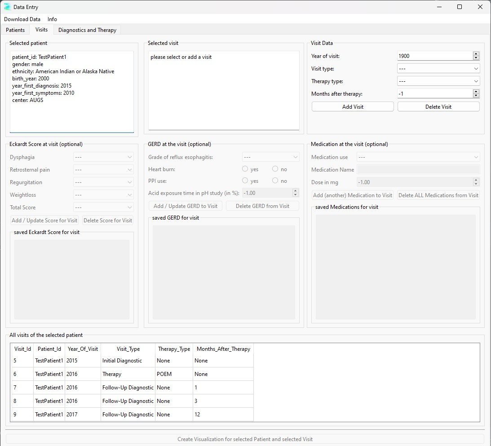
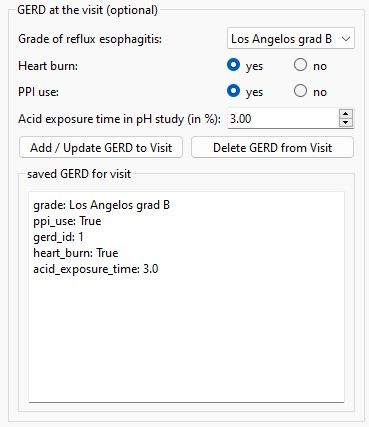

# The Visits Tab

After selecting a patient in the Patients Tab, the Visits Tab allows you to manage and document patient visits, including adding visit details, recording scores, and tracking medications.

## Adding Visits

In the Visits Tab, you'll see an overview of all visits for the selected patient, if any are already saved in the database. You can either select an existing visit or add a new one.

When adding a visit, basic validity checks are performed on the data you enter:

- The "Therapy Type" field can only be filled if the visit type is set to "Therapy."
- The "Months After Therapy" field can only be filled if the visit type is "Follow-Up Diagnostics." Otherwise, it should remain at the default value of -1.

After adding or selecting a visit, you can optionally add additional data for this visit, including the Eckardt Score, GERD Score, and any medications the patient received. All of these fields are optional.

## Eckardt Score

To add an Eckardt Score for the visit, fill out the relevant fields. All fields, except for the "Total Score," are optional. Validity checks will be performed to ensure accuracy.

## GERD Score

For the GERD Score, all fields are optional. If you cannot or do not wish to enter specific data, leave the fields at their default values.

## Medication

For medication, the "Medication Use" field is mandatory. The "Medication Name" and "Medication Dose" fields are optional. You can enter multiple medications for a single visit.

## Updating Data

Since each visit can have only one Eckardt Score and one GERD Score, you can update or correct these by inputting the new information and clicking the "Add/Update" button. 

However, because multiple medication records can be associated with a single visit, it is currently not possible to update a specific medication entry individually (as this would require a unique ID for each record). Instead, you can delete all medications associated with the visit and re-enter them. Note that it is not possible to delete a single medication entry.

## Tip

Remember, for easier data entry, use the Tab key on your keyboard to navigate through the fields. After entering information in one field, press the Tab key to move to the next field.

