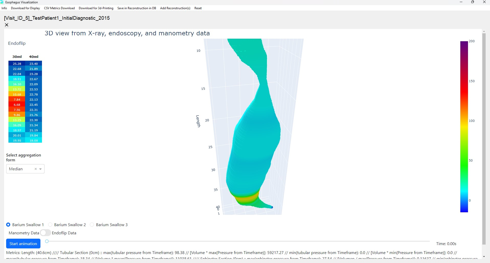

# The Viszalization Window

The visualization window shows the 3D reconstructions you created.

## View and Adjust the Visualization

- **Rotate**: Click and drag the visualization with the mouse to rotate it.
- **Move**: Hold the **Ctrl** key while dragging to move the visualization.
- **Resize**: Use the mouse wheel to zoom in or out.

### Animation

- **Start Animation**: Clicking this button animates the temporal evolution of the pressure values over time.
- **Timeline**: You can manually select a specific time point using the timeline.

### View Indices

- The size of the esophagus (in centimeters) is displayed in the legend. If this deviates significantly from the expected size, it may indicate that sensor positions were entered incorrectly or inaccurately.
- The calculated metrics for the tubular esophagus section (Volume * Pressure) and the lower esophageal sphincter (Volume / Pressure) are shown over time.

## EndoFLIP Data

- If EndoFLIP data has been entered, an **EndoFLIP screenshot** will appear to the left of the 3D reconstruction, showing values from **P16 to P1**.
- **Select Aggregation Form**: You can choose how the data is aggregated in the screenshot.
- A switch below the reconstruction allows you to choose which **colors** are projected onto the reconstruction.
- You can also select whether to display **30ml or 40ml balloon volumes** from EndoFLIP.
  
*Note*: EndoFLIP data processing has not been extensively tested. Always verify the results with the manufacturer’s visualization.

## Compare Multiple 3D Reconstructions

- You can visualize multiple reconstructions by clicking Insert "Add Reconstruction(s)"
- If you have multiple reconstructions you can **rearrange them** by holding down the left mouse button and dragging them to the desired position.

## Download Options

1. **Download for Display**: Export *currently displayed* the 3D visualizations as **HTML files**, which can be viewed in a web browser or embedded in PowerPoint presentations.
2. **CSV Metrics Download**: Exports the metrics as a CSV file.
3. **Download for 3D Printing**: Downloads `.stl` files *of all 3D reconstructions in the viewer* for **3D printing**. Note that downloading may take a few minutes.
4. **Save Reconstruction in DB**: Saves the reconstruction(s) to the database, allowing you to load and view it again later, unchanged.  If a reconstruction already exists for that visit, the program will prompt you to confirm if you want to update the existing reconstruction.

Once the download is complete, the program will provide confirmation for each download format.

## Reset the Visualization Window

Use the **Reset** button to clear the input fields and load new files, allowing you to create a new visualization.